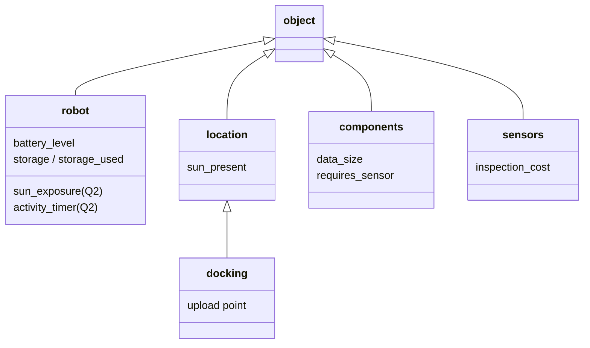
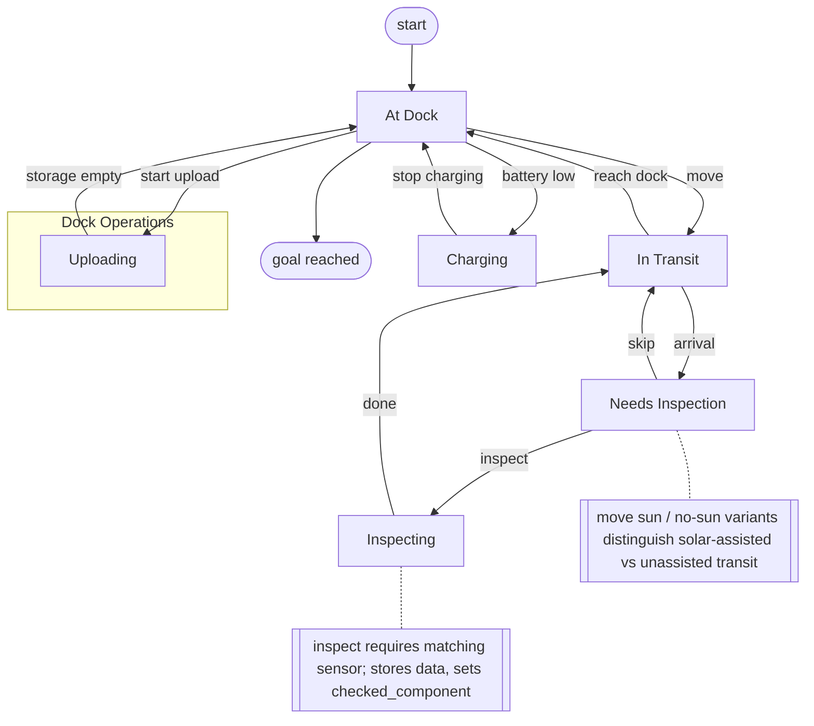
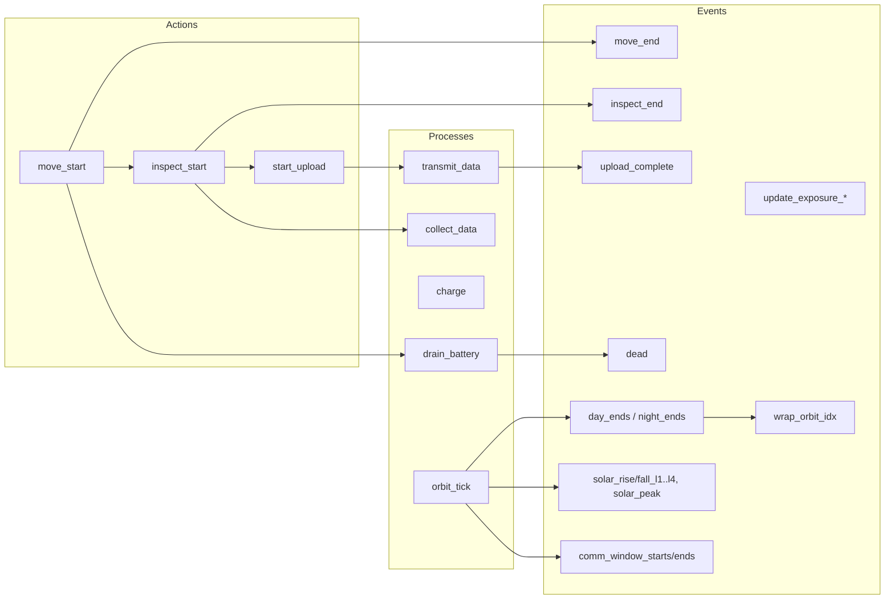

<div align="center">

<br/>

<pre>
 ██████╗ ██████╗ ██████╗ ██╗████████╗ █████╗ ██╗          
██╔═══██╗██╔══██╗██╔══██╗██║╚══██╔══╝██╔══██╗██║          
██║   ██║██████╔╝██████╔╝██║   ██║   ███████║██║          
██║   ██║██╔══██╗██╔══██╗██║   ██║   ██╔══██║██║          
╚██████╔╝██║  ██║██████╔╝██║   ██║   ██║  ██║███████╗     
 ╚═════╝ ╚═╝  ╚═╝╚═════╝ ╚═╝   ╚═╝   ╚═╝  ╚═╝╚══════╝     

██╗███╗   ██╗███████╗██████╗ ███████╗ ██████╗████████╗██╗ ██████╗ ███╗   ██╗
██║████╗  ██║██╔════╝██╔══██╗██╔════╝██╔════╝╚══██╔══╝██║██╔═══██╗████╗  ██║
██║██╔██╗ ██║███████╗██████╔╝█████╗  ██║        ██║   ██║██║   ██║██╔██╗ ██║
██║██║╚██╗██║╚════██║██╔═══╝ ██╔══╝  ██║        ██║   ██║██║   ██║██║╚██╗██║
██║██║ ╚████║███████║██║     ███████╗╚██████╗   ██║   ██║╚██████╔╝██║ ╚████║
╚═╝╚═╝  ╚═══╝╚══════╝╚═╝     ╚══════╝ ╚═════╝   ╚═╝   ╚═╝ ╚═════╝ ╚═╝  ╚═══╝
</pre>

### *Symbolic Planning for a Free-Climbing Orbital Robot - PDDL & PDDL+*

---

<br/>

[](#4-q1-plans)
[](#5-q2-plans)
[](#8-getting-started--how-to-run-the-planner)

<br/>

</div>

---

<details>
<summary><b>Expand Table of Contents</b></summary>

* [Overview](#overview)
* [1. Domain Schematic](#1-domain-schematic)
    * [Objects and Types](#objects-and-types)
    * [Mission Flow (State Machine)](#mission-flow-state-machine)
    * [Q2 Continuous/Discrete Interaction](#q2-continuousdiscrete-interaction)
* [2. Design Choices](#2-design-choices)
    * [2.1 Q1 - Classic PDDL](#21-q1---classic-pddl-classic_pddldomainpddl)
    * [2.2 Q2 - PDDL+](#22-q2---pddl-advanced_pddldomainpddl-current-version)
* [3. Problem Files](#3-problem-files)
    * [3.1 Q1 - classic_pddl/](#31-q1---classic_pddl)
    * [3.2 Q2 - advanced_pddl/](#32-q2---advanced_pddl)
* [4. Q1 Plans](#4-q1-plans)
    * [4.1 Q1 - Simple Plan](#41-q1---simple-plan-problem_1pddl)
    * [4.2 Q1 - Hard Plan](#42-q1---hard-plan-problem_2pddl)
* [5. Q2 Plans](#5-q2-plans)
    * [5.1 Q2 - Simple Plan](#51-q2---simple-plan-p1_simplepddl)
    * [5.2 Q2 - Hard Plan](#52-q2---hard-plan-p2_hardpddl)
* [6. Technical Discussion](#6-technical-discussion)
* [7. PDDL vs PDDL+ - Summary of Differences](#7-pddl-vs-pddl-summary-of-differences)
* [8. Getting Started - How to Run the Planner](#8-getting-started---how-to-run-the-planner)
    * [Q1 - Classic PDDL, via VS Code](#q1---classic-pddl-via-vs-code)
    * [Q2 - PDDL+, via the standalone ENHSP-20 jar](#q2---pddl-via-the-standalone-enhsp-20-jar)

</details>

---

## Overview

This repository contains the PDDL (Q1) and PDDL+ (Q2) models for a single
autonomous free-climbing robot that inspects external components (solar
panels, antennas, radiators, structural joints) on an orbital platform,
as described in the assignment. The robot moves across a graph of handrail
locations, inspects components with the correct sensor, stores the
resulting data on board, and periodically returns to the docking port to
upload it.

```
classic_pddl/      Q1 – discrete PDDL model (domain + 2 problems + plans)
advanced_pddl/     Q2 – PDDL+ model (domain + 2 problems)
```

<div align="right"><a href="#top">↑ Back to top</a></div>

---

## 1. Domain Schematic

### Objects and Types



* **robot** - the single free-climbing inspection robot.
* **location** - a node of the handrail graph; `docking` is the special
  node where data is uploaded and the mission starts/ends.
* **components** - external hardware to inspect (panels, antennas,
  radiators…), each tied to one required sensing modality.
* **sensors** - inspection modalities the robot may or may not carry
  (camera, thermal camera, high‑resolution/spectrometer camera…).

### Mission Flow (State Machine)



The `NeedsInspection` lock is the key modelling device that ties movement
to inspection (see §2.1‑b) and forces a **non‑trivial inspection order**:
the robot cannot move again until it has explicitly decided, at every
node, to inspect or to skip.

### Q2 Continuous/Discrete Interaction



Actions only *start* a durative activity (`move_start`, `inspect_start`,
`start_upload`); autonomous **processes** advance the corresponding
numeric fluents (`activity_timer`, `battery_level`, `storage_used`)
continuously (`* #t …`); autonomous **events** close the activity once a
threshold is crossed (`move_end`, `inspect_end`, `upload_complete`) or
model uncontrollable environment changes (day/night cycle, solar
exposure, communication windows, battery death). `wrap_orbit_idx` resets
`orbit_index` back to 0 once 16 orbits (≈ one day) have elapsed, which is
what allows the comm window's `orbit_index <= 2` gate to become true
again on later days - this is what forces the long waits seen in the Q2
plans below.

<div align="right"><a href="#top">↑ Back to top</a></div>

---

## 2. Design Choices

### 2.1 Q1 - Classic PDDL (`classic_pddl/domain.pddl`)

**a. Types.** `robot`, `location` (with `docking` as a subtype),
`components`, `sensors` are kept as separate first‑class types instead of
collapsing everything into generic "objects", so that action signatures
are self‑documenting and the grounding stays small.

**b. Decoupling "reaching a location" from "inspecting a component".**
Every `move_*` action sets `needs_inspection`, and the robot cannot move
again until either `inspect_*` or `skip_inspection` is executed.

**c. Sun‑aware movement/inspection (`move_sun`/`move_without_sun`,
`inspect_sun`/`inspect_without_sun`).** Movement and inspection are split
into two mutually‑exclusive actions per activity, a direct, auditable
encoding of the idea that solar exposure offsets part of the energy cost
(the sun‑assisted variants only cost 60% of the equivalent battery)
while keeping the domain STRIPS‑compatible without conditional effects.

**d. Component‑specific inspection.** `requires_sensor`/`has_sensor` and
per‑sensor `inspection_cost` mean a component can only be checked with a
sensor the robot actually carries and that matches its modality.

**e. Onboard data as a numeric resource.** `data_size(c)`,
`storage_used(r)` and `storage(r)` model inspection data as a *bounded
numeric resource*, so a mission can become infeasible purely because of
storage capacity.

**f. Threshold‑triggered charging.** `charge_start`/`charge`/
`stop_charging` model a controller such that the robot may only start
charging autonomously when the `battery_level <= 5` and it is found in sunlight.

**g. Upload as a reset action.** `upload_data` is only executable at the
docking port and resets `storage_used` to 0, forcing at least one return
to dock.

### 2.2 Q2 - PDDL+ (`advanced_pddl/domain.pddl`, current version)

**a. Split start/end action‑event pairs.** `move_start`/`move_end` and
`inspect_start`/`inspect_end` replace the instantaneous Q1 actions with
durative activities driven by a process (`move_clock`, `inspect_clock`)
and closed by an event once a duration threshold is crossed.

**b. Continuous battery drain and data accumulation.**
`drain_battery` and `collect_data` change `battery_level`/`storage_used`
at a *rate* rather than as an instantaneous lump.

**c. Memory/energy‑critical events.** The `dead` event disables the
robot once `battery_level <= 0` allowing the planner to prune branches that lead to this result. While storage saturation is instead a
precondition on `inspect_start` forcing the robot to upload before it can inspect.

**d. Discretised solar factor.** `solar_factor` steps through bands
(`solar_rise_l1..l4`, `solar_peak`, symmetric falls, dawn/dusk resets)
to represent the effect that the orbital position has on the angle of that the sun rays hit the solar pannels of the robot. That angle affects efficiency of power generation through a continuous trigonometric function: `P = P * cos(θ)`. Hence it introduces unecessary domain bloat causing a blowup of millions of nodes.

**e. Three‑level sun exposure (`sun_exposure ∈ {0,1,2}`).** Tracked at
three levels (shade / half-lit transit / full sun) via dedicated events,
so `charge` can scale smoothly with regard to the how much a location is lit.

**f. Day/night, orbit wraparound and communication‑window cycle.**
`orbit_tick` advances a 90‑minute orbital clock; `day_ends`/`night_ends`
flip a 45/45‑minute cycle and increment `orbit_index`; `wrap_orbit_idx`
resets `orbit_index` every 16 orbits so the comm window's
`orbit_index <= 2` gate recurs daily. `comm_window_starts`/`ends` open a
10‑minute transmission window once every ~3 orbits, and `transmit_data` can only progresses while it's open. This single
recurring gate is the dominant factor behind the long idle stretches in
both Q2 plans below. These long generated plans are not ideal but they represent a feasable solution with such unforgiving conditions.

<div align="right"><a href="#top">↑ Back to top</a></div>

---

## 3. Problem Files

### 3.1 Q1 - `classic_pddl/`

| File | Topology | Purpose |
|---|---|---|
| `problem_1.pddl` | `dock ↔ site_a`, 1 component (`panel_1`, camera) | Minimal sanity‑check instance: single edge, ample battery (50) and storage (20), full sun everywhere. |
| `problem_2.pddl` | Star topology through a `hub`, 3 components (`panel_1`/camera, `radiator_1`/thermal, `antenna_1`/high‑res), `radiator_site` permanently shadowed | Non‑trivial instance: **storage** cap (14) is smaller than the sum of all three payloads (23), and only `panel+radiator` (13) fit together, forcing separate uploads. **Battery** starts at 19, too low to finish without recharging, and the shadowed radiator branch offers no in‑transit charging. |

### 3.2 Q2 - `advanced_pddl/`

| File | Topology | Purpose |
|---|---|---|
| `p1_simple.pddl` | `dock`, `loc_a`, `loc_b` all mutually reachable, everywhere lit, `daytime` | Generous instance (battery 25/30, storage 50). The only real constraint is the **communication window**: routing and battery never bind, so the one decision that matters is *when* to be at dock so an upload can complete. |
| `p2_hard.pddl` | Forced relay: `loc_b` reachable **only** via `loc_a` (no `dock↔loc_b` shortcut); `loc_b` in permanent shadow | Battery starts low (18/30), `loc_b` must be reached and left on a single reserve of charge, and the same recurring comm‑window gate applies - forcing the mission to be staged across multiple daily cycles. |

<div align="right"><a href="#top">↑ Back to top</a></div>

---

## 4. Q1 Plans

### 4.1 Q1 - Simple Plan (`problem_1.pddl`)

```mermaid
gantt
    dateFormat  HH:mm:ss
    axisFormat  %H:%M:%S
    title Q1 Simple Plan - rob1

    section Mission
    move dock -> site_a           :a1, 00:00:00, 1s
    inspect panel_1 (camera)      :a2, 00:00:01, 1s
    move site_a -> dock           :a3, 00:00:02, 1s
    upload_data                   :a4, 00:00:03, 1s
```



**Why it's simple:** single edge (`dock ↔ site_a`), one component, one
sensor, unlimited practical battery/storage, full sun everywhere. There's
no resource contention and no branching topology, so there is exactly
one sane action sequence - the planner isn't really solving a search
problem, it's confirming the domain's baseline mechanics work.

### 4.2 Q1 - Hard Plan (`problem_2.pddl`)

```mermaid
gantt
    dateFormat  HH:mm:ss
    axisFormat  %H:%M:%S
    title Q1 Hard Plan - rob1 (star topology via hub)

    section Scout Antenna
    move dock -> hub               :00:00:00, 1s
    skip                           :00:00:01, 1s
    move hub -> antenna_site       :00:00:02, 1s
    skip                           :00:00:03, 1s
    move antenna_site -> hub       :00:00:04, 1s

    section Charge Cycle 1 (hub)
    charge_start                   :00:00:05, 1s
    charge x7                      :00:00:06, 7s
    stop_charging                  :00:00:13, 1s

    section Radiator Branch (shaded)
    skip                           :00:00:14, 1s
    move hub -> radiator_site      :00:00:15, 1s
    inspect radiator (thermal)     :00:00:16, 1s
    move radiator_site -> hub      :00:00:17, 1s
    skip                           :00:00:18, 1s

    section Return & Upload 1
    move hub -> dock                :00:00:19, 1s
    upload_data                     :00:00:20, 1s
    charge_start                    :00:00:21, 1s
    charge                          :00:00:22, 1s
    stop_charging                   :00:00:23, 1s

    section Charge Cycle 2 (hub)
    skip                            :00:00:24, 1s
    move dock -> hub                :00:00:25, 1s
    charge_start                    :00:00:26, 1s
    charge x4                       :00:00:27, 4s
    stop_charging                   :00:00:31, 1s

    section Antenna Branch
    skip                             :00:00:32, 1s
    move hub -> antenna_site         :00:00:33, 1s
    inspect antenna (highres)        :00:00:34, 1s
    move antenna_site -> hub         :00:00:35, 1s
    skip                             :00:00:36, 1s

    section Return & Upload 2
    move hub -> dock                 :00:00:37, 1s
    upload_data                      :00:00:38, 1s
    charge_start                     :00:00:39, 1s
    charge x4                        :00:00:40, 4s
    stop_charging                    :00:00:44, 1s

    section Panel Branch
    skip                              :00:00:45, 1s
    move dock -> hub                  :00:00:46, 1s
    skip                               :00:00:47, 1s
    move hub -> panel_site              :00:00:48, 1s
    inspect panel (camera)              :00:00:49, 1s
    move panel_site -> hub              :00:00:50, 1s
    skip                                :00:00:51, 1s

    section Final Charge & Upload 3
    charge_start                        :00:00:52, 1s
    charge                              :00:00:53, 1s
    stop_charging                       :00:00:54, 1s
    move hub -> dock                    :00:00:55, 1s
    upload_data                         :00:00:56, 1s
```



**Why it's hard:** three components, three different sensors, one
location (`radiator_site`) permanently shaded so it can't be reached
with a charging safety net, a storage cap (14) too small to carry all
three payloads at once, and a starting battery (19) too low to complete
the mission without recharging. The planner must decide *when* to
recharge, *which branch to risk without sun*, and *how to split
uploads* - the resulting plan makes three separate dock round-trips, one
per component, interleaved with two full charge cycles at `hub`. Note it
didn't batch panel+radiator together even though that combo fits in
storage - a reminder that a valid plan isn't necessarily the most
storage-efficient one.

Unlike the Q2 plans below, every Q1 step is a unit-cost discrete action,
so there's no idle/waiting time to compress - the chart above is already
a true 1:1 picture of the plan.

<div align="right"><a href="#top">↑ Back to top</a></div>

---

## 5. Q2 Plans

Q2's PDDL+ semantics make idle time a first-class, *unavoidable* part of
the plan (see §2.2‑f): most of a Q2 mission is the robot parked,
waiting for `charge` and the orbit/comm-window events to bring the
environment into a usable state. That makes a single proportional Gantt
chart hard to read - one wait bar can be 100–1000x longer than every
action combined. Each problem below is therefore shown twice:

1. **Overview** - real elapsed time, proportional. This is the honest
   picture: it shows just how much of the mission is waiting.
2. **Zoomed / gap‑compressed** - every idle gap is drawn at a fixed
   nominal width (its real duration is kept in the label) so the actual
   order and relative duration of the *real* actions is readable.

### 5.1 Q2 - Simple Plan (`p1_simple.pddl`)

```mermaid
gantt
    dateFormat  HH:mm:ss
    axisFormat  %H:%M:%S
    title Q2 Simple Plan - r1 - overview (proportional, real time)

    section Locomotion
    waiting (pre-mission, align to comm window) :00:00:00, 1440s
    transit dock -> loc_a                        :00:24:00, 8s
    transit loc_a -> dock                         :00:24:15, 2s
    waiting (uploading panel1 data)               :00:24:17, 67s
    transit dock -> loc_b                         :00:25:24, 17s
    transit loc_b -> dock                         :00:25:44, 2s
    waiting (final upload)                        :00:25:46, 1s

    section Sensing
    inspect panel1 @ loc_a (cam)      :00:24:08, 7s
    inspect panel2 @ loc_b (spectro)  :00:25:41, 3s

    section Comms
    start_upload @ dock (trip 1)   :milestone, 00:24:17, 0s
    start_upload @ dock (trip 2)   :milestone, 00:25:46, 0s
```

<details>
<summary><strong>Overview - proportional, real time (click to expand)</strong></summary>

<br/>



</details>

**Zoomed - idle gaps compressed, real durations in brackets:**



```mermaid
gantt
    dateFormat  HH:mm:ss
    axisFormat  %M:%S
    title Q2 Simple Plan - r1 - zoomed (waiting compressed)

    section Trip 1 (panel1)
    transit dock -> loc_a          :00:00:00, 2s
    idle [~6s]                     :crit, 00:00:02, 4s
    inspect panel1 (cam)           :00:00:06, 3s
    idle [~4s]                     :crit, 00:00:09, 4s
    transit loc_a -> dock          :00:00:13, 2s
    idle [~67s, comm window wait]  :crit, 00:00:15, 4s

    section Trip 2 (panel2)
    transit dock -> loc_b          :00:00:19, 2s
    idle [~15s]                    :crit, 00:00:21, 4s
    inspect panel2 (spectro)       :00:00:25, 3s
    transit loc_b -> dock          :00:00:28, 2s
    upload complete                :milestone, 00:00:30, 0s
```

**Reading it:** two fully sequential round trips through dock, one per
component, instead of one combined loop. Of the ~107s of real activity,
the single biggest chunk (67s) is the robot parked at dock waiting for
`transmit_window_open` before the first upload can finish - everything
else (transit, inspecting) is only a few seconds each. Nothing about
route or resources is tight here; the whole plan is shaped by *when* the
comm window happens to be open.

### 5.2 Q2 - Hard Plan (`p2_hard.pddl`)

```mermaid
gantt
    dateFormat  HH:mm:ss
    axisFormat  %H:%M:%S
    title Q2 Hard Plan - r1 - overview (proportional, real time)

    section Locomotion
    waiting (pre-mission)                   :00:00:00, 306s
    transit dock -> loc_a                   :00:05:06, 4s
    waiting at loc_a (charge, defer panel1) :00:05:10, 1327s
    transit loc_a -> loc_b (shaded)          :00:27:17, 3s
    waiting at loc_b (before inspecting)     :00:27:20, 1435s
    transit loc_b -> loc_a (return)          :00:51:20, 3s
    transit loc_a -> dock (skip panel1 again):00:51:23, 4s
    waiting (upload panel2, recharge)        :00:51:27, 59s
    transit dock -> loc_a                    :00:52:26, 4s
    waiting (before inspecting panel1)       :00:52:30, 1369s
    transit loc_a -> dock (2nd upload run)   :01:15:23, 4s
    waiting (final upload)                   :01:15:27, 1s

    section Sensing
    inspect panel2 @ loc_b (spectro)  :00:27:23, 5s
    inspect panel1 @ loc_a (cam)      :01:15:19, 4s

    section Comms
    start_upload @ dock (panel2)   :milestone, 00:51:27, 0s
    start_upload @ dock (panel1)   :milestone, 01:15:27, 0s
```

<details>
<summary><strong>Overview - proportional, real time (click to expand)</strong></summary>

<br/>



</details>

**Zoomed - idle gaps compressed, real durations in brackets:**



```mermaid
gantt
    dateFormat  HH:mm:ss
    axisFormat  %M:%S
    title Q2 Hard Plan - r1 - zoomed (waiting compressed)

    section Approach + defer panel1
    idle [~306s, pre-mission]        :crit, 00:00:00, 5s
    transit dock -> loc_a            :00:00:05, 4s
    skip panel1 (defer)              :milestone, 00:00:09, 0s
    idle [~1327s, charge before shaded leg] :crit, 00:00:09, 5s

    section Shaded leg (panel2)
    transit loc_a -> loc_b           :00:00:14, 3s
    idle [~1435s, waiting to inspect] :crit, 00:00:17, 5s
    inspect panel2 (spectro)         :00:00:22, 5s

    section Return, defer panel1 again, upload
    transit loc_b -> loc_a           :00:00:27, 3s
    transit loc_a -> dock            :00:00:30, 4s
    skip panel1 (defer, 2nd pass)    :milestone, 00:00:34, 0s
    idle [~59s, upload + recharge]   :crit, 00:00:34, 5s

    section Final pass (panel1)
    transit dock -> loc_a            :00:00:39, 4s
    idle [~1369s, waiting for window/charge] :crit, 00:00:43, 5s
    inspect panel1 (cam)             :00:00:48, 4s
    transit loc_a -> dock            :00:00:52, 4s
    upload complete                  :milestone, 00:00:56, 0s
```

**Reading it:** the robot visits `loc_a` **three times**. On the first
two passes it explicitly `skip_inspection`s `panel1` and keeps going -
first to build up charge before risking the shaded leg to `loc_b`, then
again on the way back so it can get `panel2`'s data to dock promptly.
Only on the **third** visit - after a full second recharge/upload cycle
- does it actually inspect `panel1`. The transits and inspections
together add up to only ~31s of real activity out of 4528s total; the
rest is the robot parked at a sunlit node waiting for `charge` and the
day/orbit/comm-window events to run. `loc_b`'s permanent shadow means
the shaded leg has to be attempted with a pre-committed reserve rather
than a background top-up, and the recurring comm-window gate (same as
in the simple problem) forces dock arrivals to also line up with an open
window - together these are what push the mission across multiple
daily cycles instead of one continuous loop.

<div align="right"><a href="#top">↑ Back to top</a></div>

---

## 6. Technical Discussion

**How inspection requirements influence planning.** Because each
component demands a specific sensor and inspecting only becomes legal
once `needs_inspection` is set by arrival, the planner cannot treat
navigation and sensing as independent sub-problems: every stop forces an
explicit inspect‑or‑skip decision. In Q1 this couples the *route* to
*when* certain components can affordably be inspected. In Q2 the same
lock reappears as the repeated `skip_inspection` calls at `loc_a` in the
hard plan - the robot passes through a component's location twice before
it's actually ready (in battery, in schedule) to inspect it.

**How data storage affects mission feasibility.** In Q1, treating
inspection data as a bounded numeric resource turns "collect all the
data" into a bin‑packing‑like sub‑problem layered on top of routing
(`problem_2` forces at least two dock visits). In Q2 storage becomes a
*rate*, so feasibility depends on whether an inspection can finish - and
its data be uploaded during an open `transmit_window_open` - before
storage would overflow. Neither Q2 problem stresses storage capacity
directly, but both plans show storage's *temporal* twin: `storage_used`
can sit nonzero for a long real-time stretch while the robot simply
waits for the window.

**Limitations of representing sensor operations symbolically.** Both
models treat "having a sensor" and "matching a modality" as boolean
predicates and fixed costs, which doesn't capture sensor degradation,
partial/noisy detections, calibration drift, or failed/retried
inspections. The PDDL+ model improves fidelity somewhat (inspection
consumes battery and produces data *at a rate* over a real duration),
but sensing itself is still idealized and always successful.

**Extending toward maintenance planning.** The current
`checked_component`/`data_stored` bookkeeping is a natural precondition
layer for a follow‑up repair/maintenance domain: a
`damaged`/`needs_replacement` predicate could be asserted based on
inspection outcome, unlocking actions (`replace_unit`,
`manipulate_valve`, `install_payload`) gated by tool/spare-part fluents
and `authorized`/`calibrated` predicates. The existing
move/charge/upload machinery would be reused unchanged.

<div align="right"><a href="#top">↑ Back to top</a></div>

---

## 7. PDDL vs PDDL+ - Summary of Differences

| Aspect | Q1 (classic PDDL) | Q2 (PDDL+) |
|---|---|---|
| Movement/inspection duration | Instantaneous action, cost paid as a lump sum | `*_start` action + `*_clock` process + `*_end` event; cost accrues continuously over real time |
| Battery | Discrete decrease per action | Continuous `drain_battery`/`collect_data`/`transmit_data` processes; scaled by `#t` |
| Charging | Discrete `charge` action, +5% per call, only when `battery ≤ 5` | Continuous `charge` process, rate scales with `sun_exposure` and discretised `solar_factor` |
| Sun/shadow | Static per‑edge/per‑location boolean | Dynamic `sun_exposure` (0/1/2) recomputed by events; `solar_factor` varies with orbital position |
| Day/night & comms | Not modelled | `orbit_tick` process + `day_ends`/`night_ends`/`wrap_orbit_idx`/`comm_window_*` events model a 90‑minute orbit, a recurring 16‑orbit day, and periodic transmission windows |
| Battery‑critical condition | Implicit (actions become inapplicable) | Explicit `dead` event disabling the robot when `battery_level ≤ 0` |
| Feasibility driver | Which route/order of inspections fits storage & battery | The above **plus** exact timing: whether an activity finishes and the robot reaches dock inside a recurring open communication window before running out of charge |
| Idle/waiting time in a valid plan | None - every step is a unit-cost action | Dominant - both Q2 plans above are 90%+ idle waiting, which is why they're shown as an overview + zoomed pair rather than one chart |

The PDDL+ model is strictly more expressive but far more expensive to
ground and search, and the regenerated plans above show this concretely:
the dominant cost in both Q2 missions is no longer distance or battery
but simply waiting for the orbit to bring the comm window (and, in the
hard case, enough charge) around again - a behaviour with no analogue in
the discrete Q1 model at all.

<div align="right"><a href="#top">↑ Back to top</a></div>

---

## 8. Getting Started - How to Run the Planner

Both Q1 and Q2 are solved with **ENHSP** (the Expressive Numeric
Heuristic Search Planner), the same solver ENHSP-20 in both cases, just
invoked two different ways.

### Q1 - Classic PDDL, via VS Code

Q1 is solved directly from the editor using the **PDDL extension for VS
Code**:

1. Open `classic_pddl/` in VS Code, with `domain.pddl` and the desired
   problem file (e.g. `problem_1.pddl`) both open/visible.
2. Press **`Alt+P`** to invoke the extension's "Plan" command.
3. From the dropdown that appears, select **`enhsp`** as the planner.
4. The extension runs ENHSP in the background and renders the resulting
   plan directly inside VS Code (and as the Gantt-style plan view used
   to build the charts in [§4](#4-q1-plans)).

No manual installation of a solver binary is needed for Q1 - the
extension manages the ENHSP invocation itself once `enhsp` is selected
from the planner dropdown.

### Q2 - PDDL+, via the standalone ENHSP-20 jar

The VS Code extension's bundled solver setup wasn't used for Q2;
instead the ENHSP-20 **binary jar** was run directly from the command
line, since this made it easier to pass the extra `-planner`/`-h` flags
described below.

**Setup**

1. Download the `enhsp-20.jar` binary (distributed via Google Drive for
   this course).
2. Place `enhsp-20.jar` in the same directory as `domain.pddl` and the
   problem files (i.e. inside `advanced_pddl/`).
3. Make sure a JVM is installed (`java -version`).

**Run - simple instance**

```bash
java -jar enhsp-20.jar -o domain.pddl -f p1_simple.pddl
```

This uses ENHSP's default satisficing configuration
(`sat-hadd` - Greedy Best-First Search with the additive heuristic),
which is enough to solve `p1_simple.pddl` since nothing about the
problem is adversarial - the comm window is the only real constraint.

**Run - hard instance**

```bash
java -jar enhsp-20.jar -o domain.pddl -f p2_hard.pddl -planner sat-hmrph -h hadd
```

**What `-planner sat-hmrph -h hadd` does, and why it's used here:**

- `-planner sat-hmrph` selects ENHSP's satisficing search
  *configuration* named `hmrph`: Greedy Best-First Search combined with
  the **MRP heuristic (multi-repetition relaxed plan)** *plus* **helpful
  actions** pruning (only a subset of the applicable actions at each
  state - the "helpful" ones - are expanded, which cuts the branching
  factor substantially in a domain this size).
- `-h hadd` then explicitly overrides the heuristic function used inside
  that configuration, forcing it to use **`hadd`** (the additive
  sub‑goaling heuristic) instead of the configuration's default MRP
  heuristic. `hadd` estimates goal distance by summing the estimated
  cost of achieving each sub-goal independently, which is cheaper to
  compute per state and tends to be more robust - rather than
  optimistic/misleading - on domains with long, non-uniform waiting
  periods driven by processes and events, like the orbit/charge/comm
  cycle in `p2_hard.pddl`.
- **Net effect:** the search still benefits from helpful-actions pruning
  (fewer nodes expanded than plain `sat-hadd`), but is guided by the
  additive heuristic rather than the relaxed-plan heuristic. In practice
  this combination found a valid plan for `p2_hard.pddl` where the
  default configuration alone was considerably slower, since the hard
  instance's very long idle/charging/waiting stretches (see
  [§5.2](#52-q2---hard-plan-p2_hardpddl)) make heuristics that reason
  well about numeric sub-goal costs more effective than ones tuned
  primarily for relaxed-plan extraction.

<div align="right"><a href="#top">↑ Back to top</a></div>

---

<div align="center">

*Built with PDDL2.1 · PDDL+ · ENHSP-20 · VS Code PDDL Extension*

<br/>

**[↑ Back to Navigation Menu](#top)**

</div>
